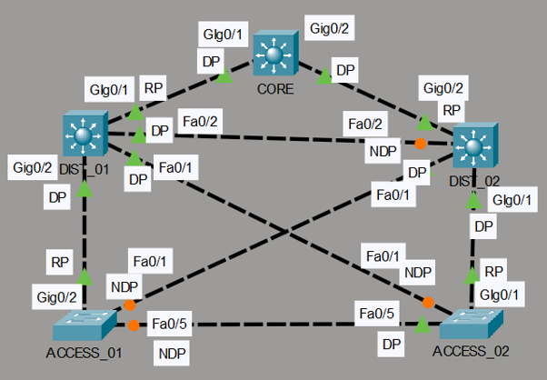
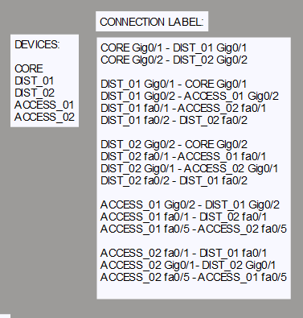

---

## 🚀 Featured Project: Advanced Spanning Tree (STP) Topology

This project demonstrates a standard 3-tier hierarchical network design (Core, Distribution, and Access layers) simulated in Cisco Packet Tracer. It highlights how Per-VLAN Spanning Tree Plus (PVST+) automatically calculates primary forward paths and blocks redundant links to prevent dangerous Layer 2 switching loops.

### 📍 Topology Diagram

### 📊 Connection Map & Device Layout

---

### ⚙️ Spanning Tree Port Status Matrix

| Switch Name | Port | Connected To | Role | Status | Plain English Explanation |
| :--- | :--- | :--- | :--- | :--- | :--- |
| **CORE** | Gi0/1 | DIST_01 | Designated | **Forwarding** | As the "Root Bridge" (Main Switch), all its ports stay wide open. |
| **CORE** | Gi0/2 | DIST_02 | Designated | **Forwarding** | Main traffic highway to the second distribution switch. |
| **DIST_01** | Gi0/1 | CORE | Root Port | **Forwarding** | This is DIST_01's fastest, direct highway up to the CORE switch. |
| **DIST_01** | Gi0/2 | ACCESS_01 | Designated | **Forwarding** | Provides a clear downstream path for ACCESS_01. |
| **DIST_01** | Fa0/1 | ACCESS_02 | Designated | **Forwarding** | Cross-connect down to ACCESS_02; stays open because DIST_01 wins priority. |
| **DIST_01** | Fa0/2 | DIST_02 | Designated | **Forwarding** | Horizontal link to DIST_02. DIST_01 wins the priority tie-breaker here. |
| **DIST_02** | Gi0/2 | CORE | Root Port | **Forwarding** | DIST_02's fastest, direct path up to the CORE switch. |
| **DIST_02** | Gi0/1 | ACCESS_02 | Designated | **Forwarding** | Provides a clear downstream path for ACCESS_02. |
| **DIST_02** | Fa0/1 | ACCESS_01 | Designated | **Forwarding** | Cross-connect down to ACCESS_01. |
| **DIST_02** | Fa0/2 | DIST_01 | Alternate | **BLOCKING** | **Loop Protection:** Stays blocked to prevent data looping horizontally between DIST switches. |
| **ACCESS_01**| Gi0/2 | DIST_01 | Root Port | **Forwarding** | Best primary uplink up to the network core via DIST_01. |
| **ACCESS_01**| Fa0/1 | DIST_02 | Alternate | **BLOCKING** | **Backup Link:** Stays asleep unless the primary Gigabit uplink fails. |
| **ACCESS_01**| Fa0/5 | ACCESS_02 | Alternate | **BLOCKING** | **Loop Protection:** Blocks the horizontal link between the two access switches. |
| **ACCESS_02**| Gi0/1 | DIST_02 | Root Port | **Forwarding** | Best primary uplink up to the network core via DIST_02. |
| **ACCESS_02**| Fa0/1 | DIST_01 | Alternate | **BLOCKING** | **Backup Link:** Stays asleep unless the primary Gigabit uplink fails. |
| **ACCESS_02**| Fa0/5 | ACCESS_01 | Designated | **Forwarding** | Stays forwarding on this segment because ACCESS_02 has a lower MAC address. |

---

### 🛡️ Edge Security & Optimizations (ACCESS_02)
* **STP PortFast (`Fa0/10 - Fa0/15`):** Bypasses standard listening/learning delays to transition access ports to a forwarding state **instantly**. This ensures client endpoints receive DHCP IP addresses without timing out.
* **STP BPDU Guard (`Fa0/20 - Fa0/24`):** If an unauthorized switch transmitting BPDUs is plugged into these edge ports, the interface immediately enters an `err-disabled` state to secure the logical topology from hijacking or unexpected recalculations.

📂 *All raw configuration scripts and the `.pkt` source file can be found in the [ADVANCE_STP](./ADVANCE_STP/) directory.*
