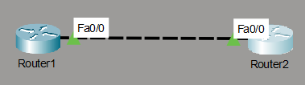

# Basic Point-to-Point Routing & Device Hardening Lab

This directory contains the configurations and network layouts for a foundational point-to-point routing environment between two Cisco 2811 routers simulated in Cisco Packet Tracer. The lab focuses on fundamental IP addressing, loopback network simulation, and baseline security hardening.

## 📍 Network Topology

Below is the point-to-point interface layout of the transit network:

### Network Addressing Plan
* **Transit WAN Link:** `192.168.1.0/24` running between the `Fa0/0` interfaces.
* **Router 1 Simulated LAN:** `192.168.2.0/24` assigned to virtual interface `Loopback0`.
* **Router 2 Simulated LAN:** `192.168.3.0/24` assigned to virtual interface `Loopback0`.

---

## 🔒 Implemented Security & Performance Hardening

To establish a secure deployment baseline, both routers are configured with the following enterprise-ready protocols:

1. **Privileged Access Obfuscation:** Configured with an MD5-hashed `enable secret` to restrict access to privileged administrative commands.
2. **Reversible Plain-Text Encryption:** Active `service password-encryption` applied globally to shield line access keys from casual viewing (`show run` shoulder-surfing).
3. **CLI Session Interruption Prevention:** The console (`line con 0`), auxiliary, and virtual teletype (`line vty 0 4`) paths run `logging synchronous` to keep syslog outputs from displacing cursor entry points.
4. **Automated Session Expansions:** An absolute `exec-timeout 5 0` value terminates terminal shells left idle for over five minutes.
5. **DNS Request Abatement:** Explicitly configured with `no ip domain-lookup` to avoid terminal lockups when syntax errors trigger unintended hostname DNS broadcasts.

### 🔑 Lab Credentials
For testing and verification purposes within the `.pkt` simulation, the following baseline line parameters have been set:
* **Console / VTY Password:** `francis` *(Obfuscated in configuration scripts via Cisco Type 7 encryption string: `08275E4F071A0C04`)*

---

## 📂 Project Directory Inventory

| File Name | Description |
| :--- | :--- |
| `Router1-config.txt` | Core running-config for Router 1 including Loopback infrastructure. |
| `Router2-config.txt` | Core running-config for Router 2 with opposing transit point IP assignments. |
