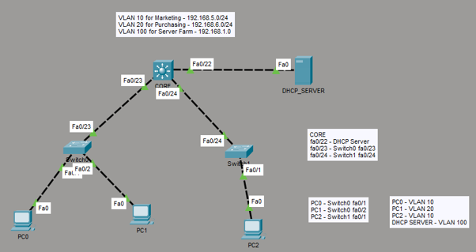

# Enterprise Inter-VLAN Routing & Centralized DHCP Relay Lab

This directory documents a scalable corporate infrastructure design simulated within Cisco Packet Tracer. The lab configures a Cisco Multilayer Switch (**CORE**) as a central Layer 3 gateway utilizing Switched Virtual Interfaces (SVIs) to bridge isolated broadcast domains (**VLAN 10** and **VLAN 20**) and securely route traffic to a dedicated Server Farm (**VLAN 100**) containing a centralized DHCP host daemon.

## 📍 Network Topology

Below is the network topology map illustrating the access links, multi-VLAN distribution boundaries, and transit trunk channels:

### Network Segmentation Plan
* **VLAN 10 (Marketing Subnet):** `192.168.5.0/24` — SVI Gateway: `192.168.5.1`
* **VLAN 20 (Purchasing Subnet):** `192.168.6.0/24` — SVI Gateway: `192.168.6.1`
* **VLAN 100 (Server Farm Segment):** `192.168.1.0/24` — SVI Gateway: `192.168.1.1`
* **Central DHCP Server Host:** `192.168.1.2/24` (Physically bound to Access Port `Fa0/22` inside VLAN 100)

---

## ⚙️ Implemented Engineering Mechanics

To maintain segmentation while ensuring automated endpoint provisioning, the core framework deploys these industry-standard operations:

1. **Hardware-Accelerated Layer 3 Routing:** Global execution of the `ip routing` command instructs the multilayer switch switch-fabric to process inter-subnet packets internally, reducing latency.
2. **Cross-Subnet DHCP BootStrap Relaying:** Standard Layer 2 DHCP discovery broadcasts are naturally contained within isolated subnets. To bridge this, the `ip helper-address 192.168.1.2` command acts as a **DHCP Relay Agent** inside the SVIs, intercepting requests and re-routing them as unicast frames targeting the server in VLAN 100.
3. **802.1Q Dot1q Trunk Multiplexing:** Transit ports `Fa0/23` and `Fa0/24` use industry-standard dot1q tagging arrays to preserve packet identity when navigating between the Core and physical Access Layer units.

---

## 🚀 Live Verification & DHCP Lease Results

During active verification of the topology, endpoints successfully broadcasted across trunk lines, navigated the Layer 3 SVI relay boundaries, and checked in with the centralized DHCP pool architecture to claim the following dynamic assignments:

* **PC0 (VLAN 10 / Switch0):** Dynamic Lease -> `192.168.5.5`
* **PC1 (VLAN 20 / Switch0):** Dynamic Lease -> `192.168.6.4`
* **PC2 (VLAN 10 / Switch1):** Dynamic Lease -> `192.168.5.4`

### Architectural Impact
These lease logs demonstrate successful operation of the multi-scope relay engine. When a broadcast is intercepted by the `CORE` switch on a designated SVI, the encapsulation header is injected with the gateway's IP address. This enables the centralized DHCP host to dynamically parse the target subnet origin and serve allocations out of the precise matching scope (preventing cross-VLAN bleeding).

---

## 📂 Project Directory Inventory

| File Name | Description |
| :--- | :--- |
| `core-config.txt` | Complete configuration profile for the Layer 3 Core routing architecture. |
| `switch0-config.txt` | Access layer configuration defining edge access ports for VLAN 10 and 20, and the dot1q uplink. |
| `switch1-config.txt` | Access layer configuration defining edge access ports for remaining VLAN 10 hosts and its trunk uplink. |
