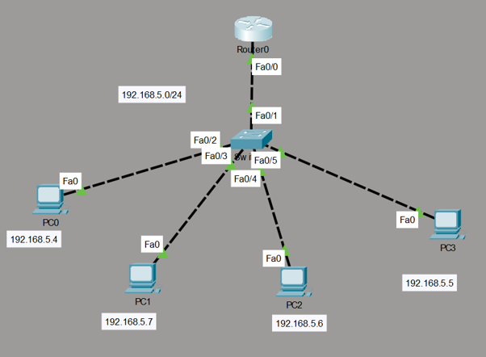

# Local Subnet DHCP Server Deployment Lab

This directory documents a local networking environment simulated in Cisco Packet Tracer. The configuration establishes a Cisco 2811 Integrated Services Router (**Router0**) as a centralized dynamic addressing authority utilizing Cisco IOS DHCP server pools to assign IP configurations cleanly to end-user workstations.

##  Network Topology

Below is the infrastructure interconnect design detailing the interface distribution points and lease targets:

### Scope & Subnet Boundary Summary
* **Active DHCP Lease Pool Subnet:** `192.168.5.0/24`
* **Assigned Default Gateway Interface:** `192.168.5.1` (Router0 FastEthernet0/0)
* **Excluded Infrastructure Range:** `192.168.5.1` - `192.168.5.3` (Reserved for static routing assignments)

---

## ⚙️ Dynamic Allocation Mechanics

To systematically allocate parameters without network duplication, the router core handles processing logic via sequential scopes:

1. **Static Safety Thresholds:** `ip dhcp excluded-address` enforces strict reservation limits. By locking out `.1` through `.3`, the server ensures standard lease queries never accidentally conflict with the active hardware default gateway.
2. **Centralized Information Scope:** The `ip dhcp pool dhcp_scope` directive automatically packages client subnet definitions alongside default-router lease assignments, reducing manual client configurations.

---

## 📂 Project Directory Inventory

| File Name | Description |
| :--- | :--- |
| `dhcp-demo-I.txt` | Core router configuration file running active DHCP server daemons. |
