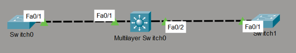

# Multi-Switch 802.1Q VLAN Trunking & Distribution Lab

This directory documents a foundational layer 2 switching infrastructure built and evaluated within Cisco Packet Tracer. The topology models a centralized high-capacity switch serving as a distribution anchor point, establishing high-bandwidth 802.1Q trunk connections to isolated downstream access layer switches to efficiently aggregate multiple broadcast boundaries.

## 📍 Network Topology

Below is the interface connection profile showing the multi-switch trunk routing pathways:

### Active Transport Profile
* **Trunk Backbone Range:** VLANs `1`, `5`, `10`, and `15` are active, unpruned, and running across all transit ports.
* **Encapsulation Protocol:** IEEE 802.1Q standard tagging arrays.
* **Loop Prevention Baseline:** Per-VLAN Spanning Tree Plus (`pvst`) running distinct logical matrix checks on each active ID path.

---

## ⚙️ Core Configuration Design Principles

To maximize link performance and reduce processing overhead, the configuration deploys these structural settings:

1. **Static Trunk Desynchronization:** All distribution links enforce explicit `switchport mode trunk` declarations. Hardcoding this prevents negotiation delays associated with Dynamic Trunking Protocol (DTP).
2. **Encapsulation Hardening:** The central distribution entity relies on the `switchport trunk encapsulation dot1q` directive to clearly map multi-tag identifiers before transmitting data down the physical line.
3. **Optimized Spanning Tree Execution:** Running standard PVST modes keeps traffic isolated per broadcast framework, ensuring that a physical loop inside one logical subnet will not cause an outage across other healthy operating VLAN paths.

---

## 📂 Project Directory Inventory

| File Name | Description |
| :--- | :--- |
| `l3-switch-config.txt` | Core switch parameters tracking dual trunk links and verification outputs. |
| `access-switch0-config.txt` | Downstream edge entity linking to the primary trunk aggregation pathway. |
| `access-switch1-config.txt` | Secondary downstream edge configuration establishing the mirrored trunk footprint. |
