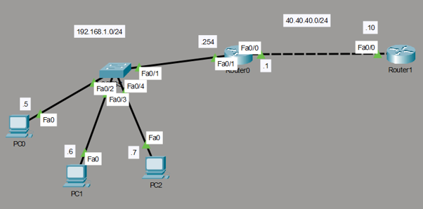

# Dynamic Network Address Translation (NAT) & Edge Routing Lab

This directory documents an enterprise edge perimeter infrastructure simulated in Cisco Packet Tracer. The design demonstrates how a local corporate network securely masks its private internal IP tier (**192.168.1.0/24**) using an active dynamic Network Address Translation (**NAT Pool**) topology across a simulated internet service provider link.

## 📍 Network Topology

Below is the network infrastructure map showcasing the inside/outside boundaries and upstream ISP transit interface:

### Network Domain Allocations
* **Inside Private LAN Subnet:** `192.168.1.0/24` (Gateway: `192.168.1.254`)
* **Outside Public Transit Network:** `40.40.40.0/24` 
* **Dynamic Public Translation Pool:** `40.40.40.1` - `40.40.40.6` (Netmask: `255.255.255.248`)
* **Simulated External ISP Gateway Router:** `40.40.40.10`

---

## ⚙️ Core Configuration Design Principles

To achieve automated address translation and stable border reachability, the gateway architecture implements the following mechanics:

1. **Explicit Domain Definition:** Highlighting translation boundaries by embedding the `ip nat inside` and `ip nat outside` parameters onto respective interface configs. This tells the internal routing fabric exactly where translation processing logic must occur.
2. **Access-Controlled Scopes:** An active IP Access Control List (`access-list 25 permit 192.168.1.0 0.0.0.255`) accurately targets internal source traffic while filtering out unauthorized ranges.
3. **Dynamic Pool Mapping:** The `ip nat inside source list 25 pool swimmingpool` engine handles address recycling automatically. It grabs public addresses from the WAN block sequentially as internal client packets step into the outside internet domain.
4. **Symmetric Default Gateways:** Inter-domain traffic routing is secured through mirrored next-hop tracking (`0.0.0.0/0`), providing a crisp exit route for outbound corporate operations and an accurate return path for returning packets.

---

## 📂 Project Directory Inventory

| File Name | Description |
| :--- | :--- |
| `router0-config.txt` | Core perimeter configuration file handling access-lists, interface bounds, and dynamic NAT pools. |
| `router1-config.txt` | Remote internet service provider router tracking static transit return avenues. |
