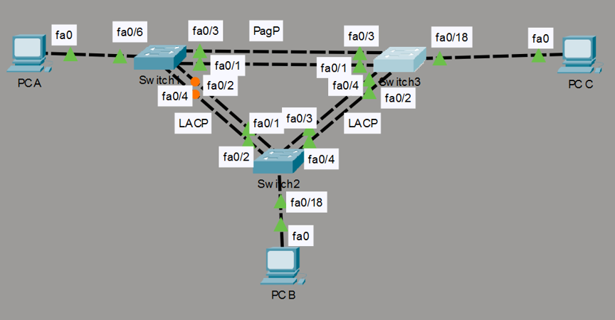

# Multi-Protocol EtherChannel Mesh & Link Aggregation Lab

This directory documents a highly available, redundant Layer 2 switching loop simulated within Cisco Packet Tracer. The architecture utilizes Link Aggregation to combine physical interface arrays into logical high-throughput channels, deploying both IEEE open-standard **LACP (802.3ad)** and Cisco-proprietary **PAgP** protocols simultaneously across a three-switch mesh topology.

## 📍 Network Topology & Specifications

Below is the network diagram tracking the redundant link assignments and protocol boundaries:

### 📊 Lab Physical & Logical Assignment Profile

| Source Node | Local Interface | Destination Node | Remote Interface | Logical Channel | Active Protocol / Mode |
| :--- | :--- | :--- | :--- | :--- | :--- |
| **Switch1** | Fa0/6 | PC A | Fa0 | Access (VLAN 10) | End-User Access |
| **Switch1** | Fa0/1, Fa0/2 | Switch2 | Fa0/1, Fa0/2 | Port-Channel 2 | LACP (Active / Passive) |
| **Switch1** | Fa0/3, Fa0/4 | Switch3 | Fa0/3, Fa0/4 | Port-Channel 1 | PAgP (Desirable / Auto) |
| **Switch2** | Fa0/18 | PC B | Fa0 | Access (VLAN 10) | End-User Access |
| **Switch2** | Fa0/3, Fa0/4 | Switch3 | Fa0/1, Fa0/2 | Port-Channel 3 | LACP (Active / Passive) |
| **Switch3** | Fa0/18 | PC C | Fa0 | Access (VLAN 10) | End-User Access |

### 🔢 IP Addressing Framework

* **Inband Management Plane (VLAN 99):** `192.168.99.0/24`
  * `Switch1` Management Interface: `192.168.99.11`
  * `Switch2` Management Interface: `192.168.99.12`
  * `Switch3` Management Interface: `192.168.99.13`
* **Data Production Plane (VLAN 10):** `192.168.10.0/24`
  * `PC A` Workstation Endpoint: `192.168.10.1`
  * `PC B` Workstation Endpoint: `192.168.10.2`
  * `PC C` Workstation Endpoint: `192.168.10.3`

---

## ⚙️ Core Configuration Design Principles

To maximize link utilization, prevent broadcast storms, and enforce infrastructure hardening, the framework implements these design steps:

1. **Deterministic Channel Matching:** Links are bound explicitly using correct logical state variables (Active/Passive for LACP and Desirable/Auto for PAgP). This permits quick channel convergence while avoiding continuous negotiation loops.
2. **Native VLAN Security Mitigation:** Native VLAN mappings are moved off the default allocation to an isolated management tier (`switchport trunk native vlan 99`). This mitigates potential VLAN-hopping attacks across trunk boundaries.
3. **Attack Surface Minimization:** All unassigned physical interface ports are structurally locked into an administrative `shutdown` state, preventing unauthorized physical access.
4. **Console & Line Hardening:** Edge access switches are hardened with an encrypted privilege EXEC secret, active VTY string parameters, custom MOTD legal warning banners, and `logging synchronous` commands to protect terminal display clarity.

