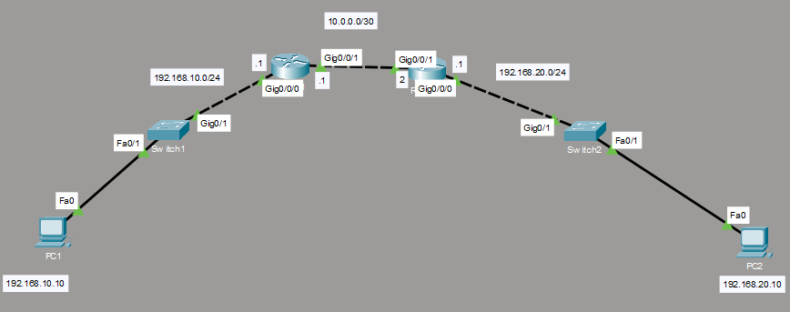

# IPv4 & IPv6 Static Routing Lab

A dual-stack network implementation built in Cisco Packet Tracer to practice IPv4 and IPv6 addressing, IPv6 EUI-64, VLAN configuration, and static routing.

## 📌 Project Overview

## 📸 Screenshots

### Network Topology



This lab simulates a small enterprise network consisting of two LANs connected through two Cisco routers.

The objective was to establish end-to-end communication between two PCs using both IPv4 and IPv6.

### Network Topology

```text
PC1
 │
 │ VLAN 10
 │
SW1
 │
R1
 │
 │ 10.0.0.0/30
 │
R2
 │
SW2
 │
 │ VLAN 20
 │
PC2
