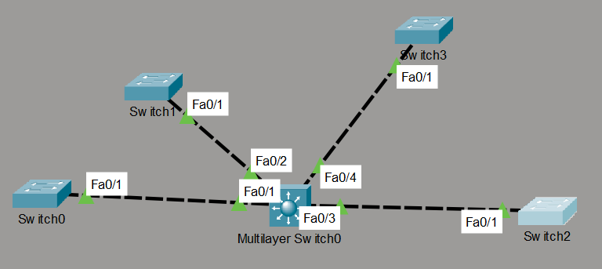

# Centralized VLAN Trunking Protocol (VTP) Distribution Lab

This directory documents an automated multi-switch local area network architecture simulated in Cisco Packet Tracer. The configuration employs **VTP Version 2** to establish a centralized management model, utilizing an enterprise multilayer distribution switch as an authorized VTP Server to automate VLAN synchronization across four distinct access layer VTP Client nodes.

## 📍 Network Topology

Below is the network topology map showcasing the star-topology distribution layout and active trunk transport pathways:

### Administrative Profile
* **VTP Domain Name:** `ccnaph`
* **Operating Framework:** VTP Version 2
* **Synchronized Target State:** Configuration Revision `17`
* **VLAN Database Capacity:** 9 actively maintained logical broadcast segments

---

## ⚙️ Implemented Engineering Mechanics

To streamline infrastructure maintenance and minimize configuration mismatch risks, the deployment leverages these structural behaviors:

1. **Centralized Authority Sync:** The master database is explicitly maintained on `Multilayer_Switch0` running in Server mode. Access switches are locked into Client mode, forcing them to learn, overwrite, and adjust local VLAN layouts based on the server's revision tracking numbers.
2. **Deterministic Trunk Mapping:** Transit channels are bound via explicit 802.1Q static trunk parameters. Hardcoding trunk properties ensures uninhibited transit lines for VTP summary advertisements and subset announcements across the switch fabric.
3. **Database Fingerprint Validation:** System synchronization is monitored and verified using the matching MD5 cryptographic digests. If a digest differs across a device link, the infrastructure prevents database updates to protect against accidental broadcast isolation.

---

## 📂 Project Directory Inventory

| File Name | Description |
| :--- | :--- |
| `Multilayer_Switch0-vtp-config.txt` | Core switch configuration and VTP verification data tracking authorization parameters. |
| `switch0-vtp-config.txt` | Access layer client configuration demonstrating revision sync 17 over port Fa0/1. |
| `switch1-vtp-config.txt` | Access layer client configuration demonstrating revision sync 17 over port Fa0/1. |
| `switch2-vtp-config.txt` | Access layer client configuration demonstrating revision sync 17 over port Fa0/1. |
| `switch3-vtp-config.txt` | Access layer client configuration demonstrating revision sync 17 over port Fa0/1. |
